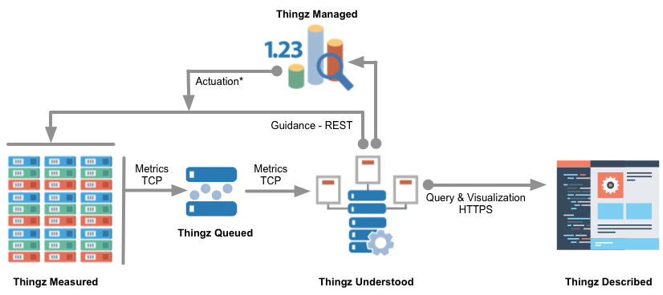

# thingz-agent

> Thingz understood

This agent works in tandem with the [thingz-server](https://github.com/mchmarny/thingz-server) to provide demonstration of both the dynamic modeling to support actuation as well as forensic query and visualization.

It supports following pushers: 

* `stdout` - output to console
* `kafka` - queues messages in Kafka 
* `influxdb` - publishes to REST endpoint using InfluxDB API
* [ws-collector](https://github.com/cloudfoundry-community/ws-collector) - transparent WebSocket gateway to Kafka

> Add your own publishers by implementing the publish interface (`publishers/publisher.go`)

## Topology

These publishers can be combined into following topologies

### Simple Deployment

For smaller deployments (<200 thingz) the agents can report directly to the `thingz-server` over either UDP or REST

* `thingz-agent` directly to InfluxDB over HTTP (best for few clients)
* `thingz-agent` directly to InfluxDB over UDP (best for controlled network environment)


### Scaled Deployment

For larger deployments, or for situations where an external scheduler will be involved, the `thingz-agent` can be configured to report to a Message Bus (Apache Kafka) from where `thingz-server` would load messages to InfluxDB over UDP (most scalable but requires additional service and ability to route data from `thingz-agent` to the InfluxDB over UDP)




## Strategies 

Strategies tell the agent what dimensions and how often it should report to the `thingz-server`. You specify a strategy by defining one or more of Key/Value pares where the key is the dimension and the value is the reporting frequency in seconds.

> Available Dimensions:


* **cpu**  - user, nice, sys, idle, wait, total
* **cpus** - just like above but for each CPU individually
* **mem**  - free, used, actual free, actual used, total
* **swap** - free, used, total
* **load** - avg for 1, 5, 15 min
* **proc** - process name and resident memory

## Install

To install agent locally (depends on golang [installed](http://golang.org/doc/install)):

```
go get github.com/mchmarny/thingz-agent
go install github.com/mchmarny/thingz-agent
```

To deploy multiple instances of the `thingz-agent` on AWS EC2 execute the `scripts/deploy-agent-aws.sh` script.

## Run

Export a few environment variables

* `THINGZ_HOST` is the [thingz-server](https://github.com/mchmarny/thingz-server) host
* `THINGZ_SECRET` is the agent secret 

Once these two variables are defined, you can imply start the agent using the following command: 


```
./thingz-agent --source="${HOSTNAME}" \
               --strategy=cpu:10,cpus:60,mem:15,swap:30,load:15 \
               --publisher="influxdb" \
               --publisher-args="udp://agent:${THINGZ_SECRET}@${THINGZ_HOST}:4444/thingz" 
```                  

The Kafka publisher flags look like this:

```
...
    --publisher="kafka" \
    --publisher-args="${TOPIC}, ${HOST1}:${PORT}, ${HOST2}:${PORT}"
```               

> Note, the `source` parameter can be anything that uniquely identifies this host. If the `HOSTNAME` includes periods (`.`) you can override this value with your own nickname for this host (e.g. `server-1`)


